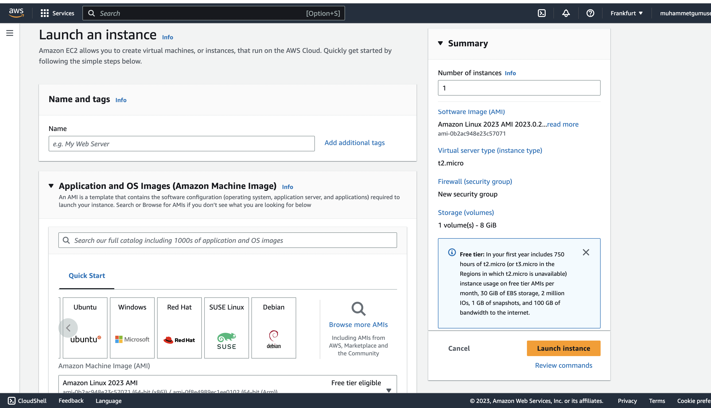
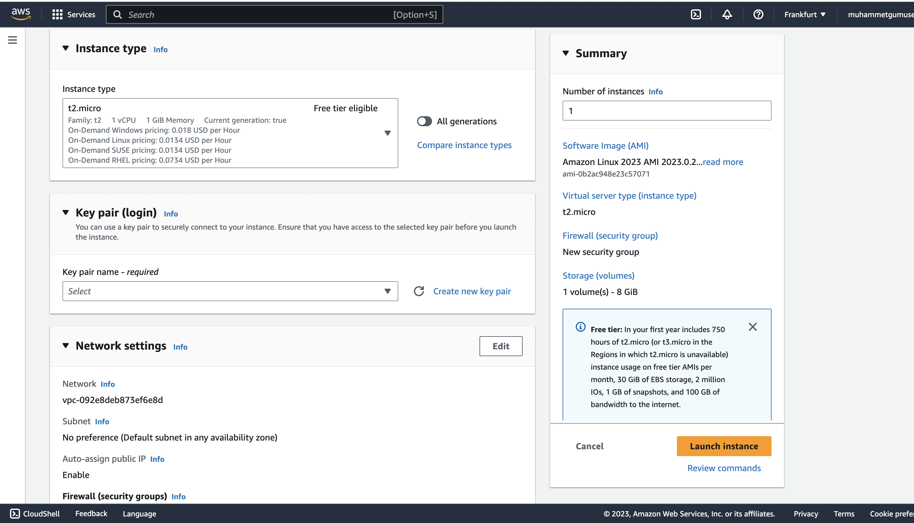
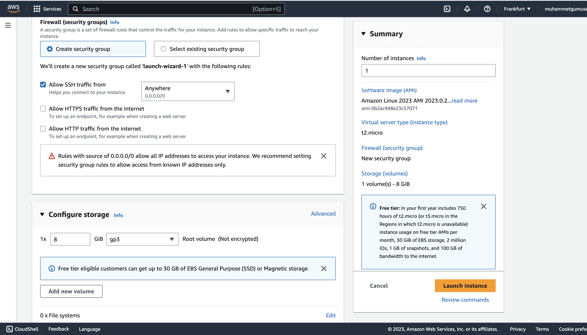
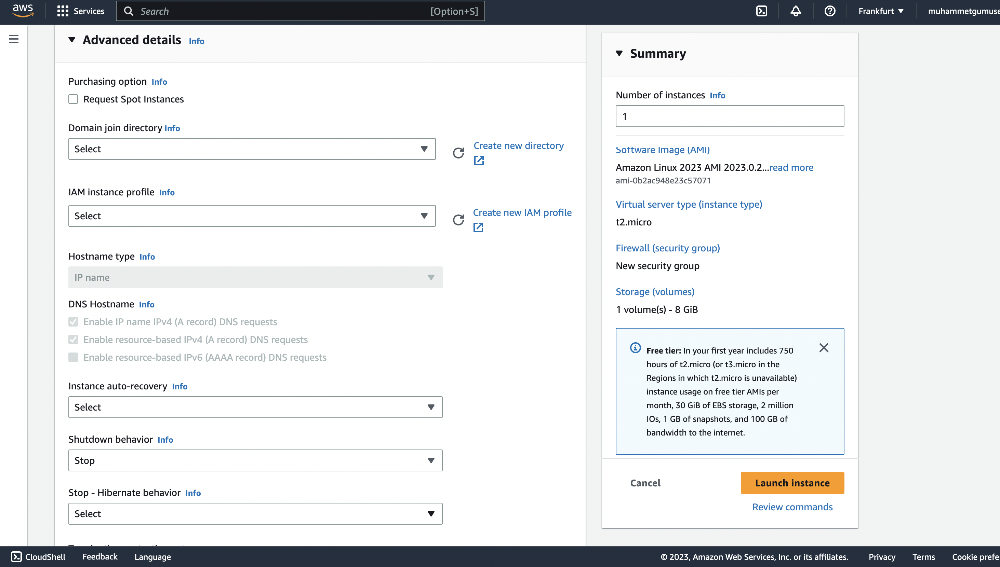

# Amazon EC2 (Elastic Compute Cloud)

* It is one of the most used and fundamental services of AWS.
* It provides virtual machines to the users.&#x20;
* Mainly consist of capabilities:
  * Renting virtual machines.
  * Data storing on virtual drives (EBS - Elastic Block Store).
  * Distributing load across machines (ELB-ALB)
  * Scaling the services using an auto-scaling group (ASG)

When you create an instance of EC2 you have to set some configurations that are related to this virtual machine. They are as follows:

* **Operating Sytems**: Linux, Windows, Mac OS etc.
* **CPU**: You have to set core numbers and values of them.
* **RAM**: You also have to set the Random Access Memory size of this instance.
* **Storage**: There are options for this config like **Network-attached (EBS\&EFS)** or **Hardware (EC2 Instance Store).**
* **Network Card**: Public IP Address and Speed of the Network Card also need to be set.
* **Firewall**: Security is important so we should concern about them.
* **Bootstrap Script: (EC2 User Data)** It runs commands **at the first launch.** It runs <mark style="color:red;">**only once**</mark>**. It is usually used for automated tasks, downloading files, updating files, installing software etc.** This script is executed only by the <mark style="color:red;">**root**</mark> account**.**

### Create an instance

You could create and set the configurations that we mentioned earlier to the virtual machines via AWS Management Console using the path **EC2 > Instances > Launch an instance.**&#x20;

Let's look at the instance create page.

In the first step you could set name and the Operating Sytem of the instance.

<figure><figcaption>
Name Setting and Operating System Selection
</figcaption></figure>

Then you could set **Instance type** according to the usage or purpose of the project. If it is a small or hobby project you could use micro instances.

<figure><figcaption>
Instance Type Selection
</figcaption></figure>

After that, you could set **Key pair** for secure access to our instances and **Firewall** options like incoming and outgoing traffics. HTTP/HTTPS-related options and reaching our instance over the Internet etc. Finally we see the Configure storage section. This section gives us ability to set the storage of the instances and volume configs.

<figure><figcaption>
Security &#x26; Storage Selection
</figcaption></figure>

In the end, we are able to set the EC2 User Data script and lots of Advance details of instances.

<figure><figcaption>
Advance Details
</figcaption></figure>

After setting these options press the Launch Instance button then our EC2 instance is will be ready to up and running in seconds :sunglasses::rocket:

&#x20;
