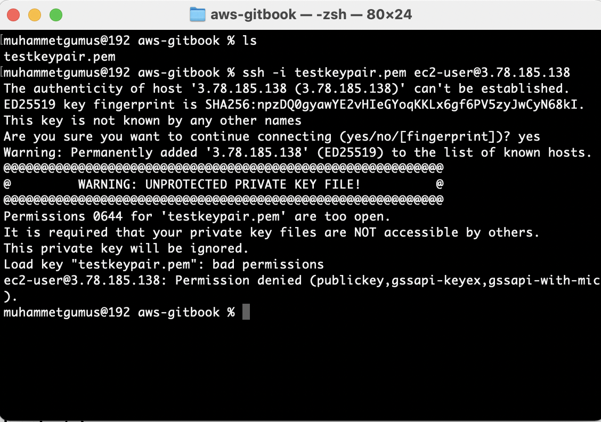

# Key Pair & SSH Connection

### Key Pairs

Security should always be one of our first concerns while working in a cloud environment. After setting related configs we should safely connect to our EC2 instances and web services. Creating key pair is the first step of this process. After creating key pairs. Key pairs include public and private keys that give the ability to identify whether the connection is secure and trustworthy. For example thanks to key pairs, Linux users are able to connect the instances from their local to EC2 instances with SSH clients. It is easily can be created and downloaded by using AWS Management Console. But <mark style="color:red;">**Keep it private!!!**</mark>

**Note**<mark style="color:red;">**:**</mark>** For users with Linux, Mac and Windows>10 download the **<mark style="color:red;">**.pem**</mark>** extension file.** **Download **<mark style="color:red;">**.ppk**</mark>** extension key pairs file for Windows<10 users.**

It can be created through path **EC2> Key pairs > Create key pair**

<figure><figcaption><p>Create Key Pair</p></figcaption></figure>

After pressing Create key pair it will create and download the file automatically. Then in your file system put the downloaded file in any folder that you want.


### SSH Connection

After creating a key pair process, now we are ready to connect to our instances via SSH Client. **Also don't forget to add this key pair and allow SSH connection on the instance that we want to connect. Otherwise, you are not able to connect to the instance.**

First, go to the folder where the downloaded key pairs are located.

<figure><figcaption></figcaption></figure>

Then change the  read write execute roles using the **chmod** and set to it **400**  otherwise you may get the following error related to file permissions.

<figure><figcaption><p>SSH Error</p></figcaption></figure>

Then add the following line to the command line and execute.

```bash
chmod 0400 filename.pem // My file is testkeypair yours can be different
```

After changing the key pair files roles we are ready to connect the instance.  But before the connection, we will use the **ec2-user** user that was given to us by default after the instance creation. Also the IP address is the Public IP that is automatically set to instance. You could check it from the console.

<figure><figcaption></figcaption></figure>

If you see this kind of log yes you connected to an EC2 instance that you create :tada::rocket::sunglasses:
