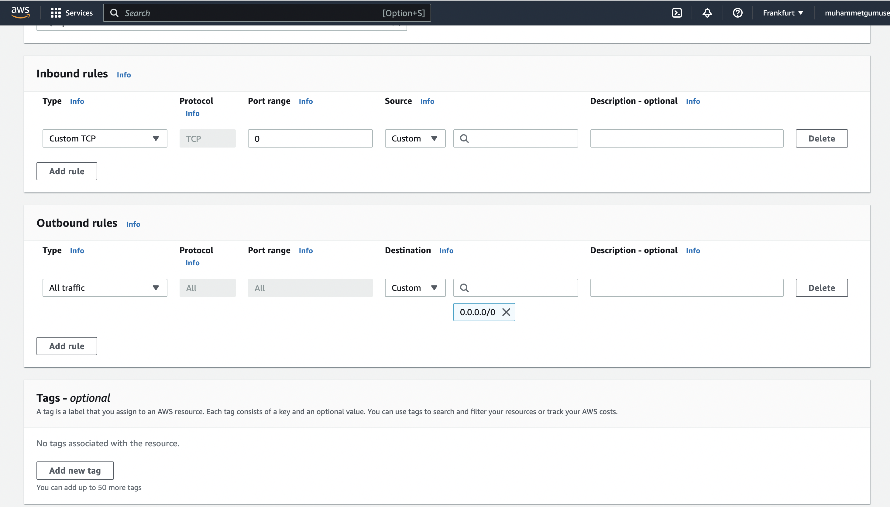

# Security Groups

<figure><figcaption>
Security Groups
</figcaption></figure>

Security Groups are fundamental of network security in AWS. Some characteristics of them are listed below :

* Acts as a **firewall** on EC2 instances.
* They control incoming and outgoing traffic of the EC2 instances.
* Only contain **allow** rules.
* Rules can be referenced by IP Addresses or other Security Groups.
* One security group can be attached to multiple instances.
* Internally regulate access Ports, authorise IP ranges and inbound & outbound networks.
* If you change the region or VPC you should create the same security groups again.
* By default all inbound traffic is blocked and outbound traffic is authorized.
* If you encounter with <mark style="color:red;">**timeout**</mark> <mark style="color:red;">**error**</mark> it's probably a **security group problem**!
* Some Classic ports to know **22** SSH (Linux), **21** FTP, **22** SFTP, **80** HTTP, **443** HTTPS, **3389** (Windows instance) RDP

It can be created through path  **EC2 > Security Groups > Create security group** . It looks like the below on the AWS Management Console.

<figure><figcaption>
Security Group Create
</figcaption></figure>
