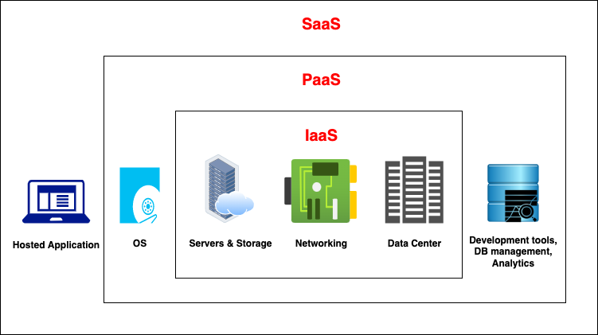

# Cloud Computing Types

In the previous chapter, we explained what is cloud computing, its characteristics and its advantages. Now it is time to check what are the types of cloud computing.

<figure><figcaption></figcaption></figure>

### Infrastructure as a Service

We can easily say that this concept is one of the first cloud computing types of the cloud world. It provides clients to base infrastructure (virtual machine, storage, network etc.) or machines that installed images that you want to work with (Ubuntu, Debian, Windows etc.) The cloud provider's duty is to keep these machines up to as long as possible. Kinda we are paying for hardware and facilities. All the other responsibilities belong to the clients. For example software, storage management, security, etc. Clients are able to install and execute any kind of program on their machines if there is not any restriction by the cloud providers like not allowing mining or harmful programs.


**Examples**: EC2, Google Compute Engine, Digital Ocean


<mark style="color:green;">**Pros**</mark>

* Cheap
* Gives nearly full freedom because you are not restricted about what you want to do.

<mark style="color:red;">**Cons**</mark>

* Maintenance is hard than other types
* Deploy is hard and challenging e.g. clients need to set SSH, FTP etc.
* Security Updates
* Software Compatibilities need to handle by clients
* Infrastructure Parts configuration and maintenance need to be handled by clients. (Load Balancer, Firewall, IP. **These services also can be provided by cloud providers too**)

### Platform as a Service

This cloud computing type provides a complete development and development environment in the cloud with resources that enable us to deliver everything from simple apps to sophisticated ones. This kind of cloud service gives infrastructure management flexibility more than services like IaaS. For example, PaaS services abstract their clients from the responsibilities of low-level maintenance of coding environments and setting up the infrastructures. On the other hand, even it gives these kinds of opportunities it may restrict their clients like using some specific programming languages, frameworks, software versions or platforms etc. These types of services aim to developers design and focus their businesses and codes\


**Examples**: AWS Elastic Beanstalk, Heroku, Azure Web Sites


\
<mark style="color:green;">**Pros**</mark>

* Autoscale, Load Balancing
* Don’t need to set up infrastructure, machines etc.
* Directly upload application source code
* Pay as you use

<mark style="color:red;">**Cons**</mark>

* Restricted programming languages, frameworks
* Usually web server applications
* Expensive than IaaS

### Software as a Service

These kinds of cloud computing types are usually services that are accessible by client's web browsers. We could say they provide all-in-one services or programs. I mean users just need to enter and use their service without thinking about any of the infrastructural or programmatical problems. They have completed products that are run and managed by cloud providers


**Examples**: Gmail, Dropbox

